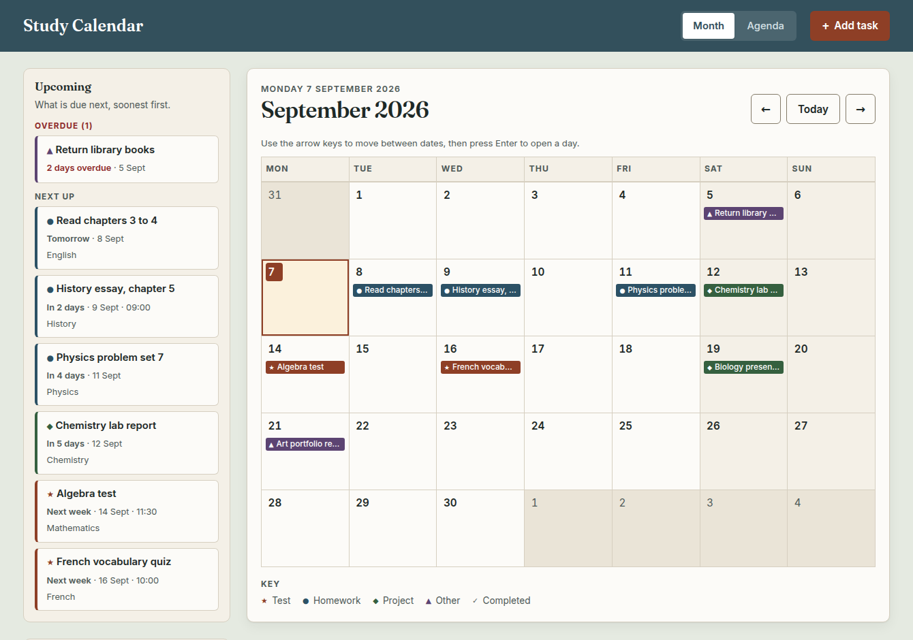

# Remembre

A personal work calendar for schoolwork: tests, homework and every other
assignment in one month view, with a running list of what is due next.

No accounts, no server, no build step. It is three files &ndash; `index.html`,
`styles.css`, `app.js` &ndash; and two self-hosted typefaces. Tasks are saved in
the browser's own storage, so nothing about your coursework leaves your device.



## What it does

- **Add a task in one step.** Title, type, due date, and optionally a time, a
  subject and notes. Tests, homework, projects and anything else each get their
  own colour, glyph and label.
- **See the month at a glance.** Every day cell lists what is due, with today
  marked and weekends tinted.
- **Know what is next.** The Upcoming panel puts overdue work first, then the
  next six things due, each with a plain-English "Tomorrow" or "In 4 days".
- **Switch to an agenda** when a list is easier to read than a grid.
- **Tick things off.** Completed tasks are hidden by default and can be shown
  again from the sidebar.
- **Filter by type**, so a revision week can show only tests.
- **Keep a backup.** Export writes a JSON file; import can either replace the
  calendar or merge into it.

## Accessibility

This was built to be usable without a mouse, without colour vision, and at
whatever text size you need. Concretely:

- **The month grid is a real table** with column headers, so a screen reader
  announces "Wednesday" along with the date. Each day is one button whose label
  reads out the full date and everything due: *"Wednesday 14 October 2026.
  2 tasks: Homework, Biology worksheet; Test, Algebra, at 11:30."*
- **The grid is fully keyboard-driven** on the ARIA roving-tabindex pattern:
  one tab stop, then arrow keys by day and week, <kbd>Home</kbd> and
  <kbd>End</kbd> for the week, <kbd>Page&nbsp;Up</kbd> and
  <kbd>Page&nbsp;Down</kbd> by month (hold <kbd>Shift</kbd> for a year), and
  <kbd>Enter</kbd> to open a day. Crossing a month boundary moves the calendar
  and keeps focus on the date you navigated to.
- **Colour is never the only signal.** Each type also carries a distinct glyph
  (★ test, ● homework, ◆ project, ▲ other) and a spelled-out label, in the
  sidebar, the chips, the key and the badges.
- **Contrast meets WCAG 2.1 AA** in both themes &ndash; verified, not assumed.
  `npm test` reads the colour tokens straight out of `styles.css` and checks
  every foreground/background pair the interface uses.
- **Focus is never lost.** Completing a task removes its row when completed
  tasks are hidden, so focus is deliberately moved to the row that replaced it
  rather than dropped to the page body. There is a test for this.
- **Changes are announced** through a polite live region: tasks added, saved,
  completed or deleted, and every change of month.
- **It reflows** to a single column and survives 200% zoom with no horizontal
  scrolling, down to a 320px viewport.
- **It respects your settings**: `prefers-color-scheme`, `prefers-reduced-motion`
  and `prefers-contrast`, with a manual light/dark override in the sidebar.
- Every target is at least 44px tall, every form field has a real label, and
  errors are reported in text next to the field they belong to.

Keyboard shortcuts: <kbd>N</kbd> adds a task, <kbd>T</kbd> jumps back to today.

## Running it

It is a static site, so any web server will do:

```sh
npm run serve     # then open http://localhost:8000
```

Opening `index.html` straight from disk works too, except that browsers refuse
to load the fonts over `file://`, so the page falls back to system faces.

## A single-file build

```sh
npm run build      # writes dist/remembre.html
```

That bundles the stylesheet, the script and both typefaces into one HTML file
with no external requests, so it runs from a double click with no server. Handy
for a USB stick or an offline laptop.

## Tests

```sh
npm install       # playwright, for the browser test only
npm test
```

`tools/check-contrast.mjs` checks the palette. `tools/smoke-test.mjs` serves the
site, drives it in Chromium and asserts the behaviour above. Both exit non-zero
on failure.

## Deploying

There is nothing to build. Point any static host at the repository root; the
included `vercel.json` sets long-lived caching for the fonts and the usual
security headers.

## How it is put together

| File | What lives there |
| --- | --- |
| `index.html` | The whole document: app bar, sidebars, month table, agenda and the two dialogs. |
| `styles.css` | Design tokens for both themes, then components. Fonts are declared at the top. |
| `app.js` | State, storage, rendering, keyboard handling. No dependencies. |
| `tools/` | The contrast checker and the browser smoke test. |

Dates are stored as local `YYYY-MM-DD` strings and never as `Date` objects, so
a task due on the 14th stays on the 14th in every time zone.

Type is [Fraunces](https://fonts.google.com/specimen/Fraunces) for the wordmark
and month heading, [Inter](https://fonts.google.com/specimen/Inter) for
everything else; both are subset to Latin and served from `fonts/`.
