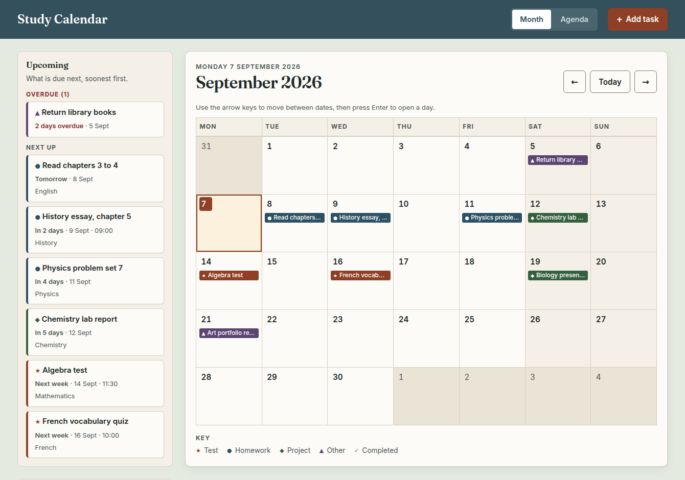
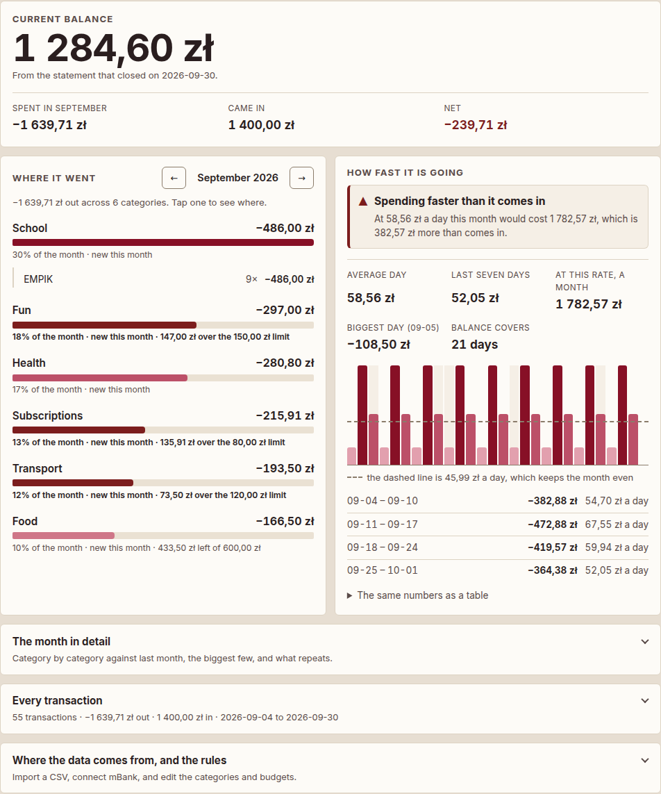

# Get a grip

A personal work calendar for schoolwork: tests, homework and every other
assignment in one month view, with a running list of what is due next.

No accounts, no build step. It is three files &ndash; `index.html`, `styles.css`,
`app.js` &ndash; and two self-hosted typefaces. Tasks are saved in the browser's
own storage, so nothing about your coursework leaves your device unless you ask
it to: there is an optional server in `api/` that keeps two devices in step and
feeds your calendar app, and the rest works with no server at all.



## Two halves

The welcome hands over to a choice: **Schoolwork** or **Money**. The choice is
remembered for the session, so a reload puts you back where you were, but a
fresh launch asks again -- they are separate errands, and which one you are on
is not a setting.



Money runs on a surface of its own, dark in both themes, and the bar and the
footer come with it: a ledger is read at a glance at the top of the hour, the
figures want to glow rather than sit on paper, and a page that is dark in the
middle and warm at both ends reads as two apps stacked. Every contrast pair is
measured by `tools/check-contrast.mjs` and the ramp by the dataviz validator;
nothing in here was chosen by eye.

It opens with the time of day and your name, and then the dashboard, in the
order the questions actually get asked:
**what have I got**, **where did it go**, **how fast is it going**. The
statement, the setup and the month in detail are folded away underneath,
because nobody opens a money app to re-read last Tuesday.

### The balance

The first figure on the page is what is in the account, and it is never a sum
of what has been imported -- a CSV reaching back ninety days does not know what
the account held ninety days ago. It comes from whoever actually knows, in this
order: the bank, through the connection; the statement's own closing balance
(mBank's *Saldo ko&#324;cowe* footer, or the newest row's running balance),
rolled forward over anything dated after it; or nothing at all, said plainly.
Where it came from is always printed beside it, because "1 842,10 z&#322; at the
bank" and "1 842,10 z&#322; as at 28 September" are different claims.

Watching it is the only kind that is useful on a device you own: the figure is
compared with the one you were shown last time and the difference leads the
card. Nothing is polled -- a balance changes when a transaction arrives, and
that is already an event here.

### Where it went, and how fast

Categories are drawn as bars in **one hue, light to dark**: the colour means
"bigger", which five different colours could not say. Every bar carries its own
figure, its share of the month and what it was last month, so the colour is
decoration and the number is the data; tap one and it opens to show who was
actually paid. Past a budget the bar leaves the ramp, and the words beside it
change too.

The rate card is four weeks of daily columns with a dashed line across them at
what a day may cost if the month is to fit inside the money coming in. The
window never reaches further back than the data goes: counting the days before
a statement starts as zeros would understate the rate by a quarter and turn an
overspending month into a comfortable one. Under it a verdict --
*sustainable*, *tight*, *spending faster than it comes in*, or *not enough to
tell yet* -- with a mark, a word and the arithmetic spelled out. Income is the
**median** of the complete months rather than the mean, so one transfer from a
grandparent does not become a monthly salary.

Money moved to your own account is not spending and is left out of both;
cash withdrawals are not, because the money has left the account and where it
went afterwards is not something a statement knows.

### One transaction, up close

The biggest single payments in a month are usually the ones somebody else was
covering, and a day-to-day budget with a 620 z&#322; concert ticket sitting in
it reads wrong all month. The rules cannot know which is which -- only the
person who spent it can -- so every row in every list of transactions opens,
and moving one out of the month is one tap.

Opening a category now lists the payments inside it, biggest first, rather
than a summary by payee: the one worth moving is a single row, and a total
hides it. Each row carries what it is and what it cost, and taps through to
the detail -- the amount, the dates, which side of the plan it is on, what it
was linked to if anything, and whether it came from mBank or from a CSV.

Two things can be changed there, and both are marked as yours so the automatic
passes leave them alone: **move it outside the plan**, which takes it off the
budget and out of the daily rate without deleting anything, and the
**category**, which from then on is ignored by the rules rather than
overwritten by them on the next import.

### The week, and the weekend

A month's spending money divided evenly over thirty days is a plan nobody
lives: the week is cheap and Friday night is not, and a budget that pretends
otherwise is broken by the first ordinary Saturday. So the same monthly total
is split two ways -- a lower weekday rate and a weekend rate worth about 1.8
times as much -- with the two solved against the real count of each kind of
day in the month, so the arithmetic closes exactly. **Nothing is saved or lost
by the split**; it only moves when the money is allowed to be spent, which is
why the long-term saving is untouched by construction.

The weekend begins on Friday, because that is when the money is spent. A model
where Friday is a weekday and Friday night comes out of the weekend charges
one evening to two budgets; a model where the night out comes out of a
Tuesday's allowance is one nobody would keep.

Then the week carries: every z&#322;oty not spent between Monday and Thursday
is a z&#322;oty on top of the weekend, which is the entire point of spending
less on a Tuesday. **Every Friday morning the line under the greeting says what
the week put by** -- "You kept 86,40 z&#322; back this week, so the weekend has
314,16 z&#322;" -- and on Saturday and Sunday it says what is left of it. A week
that ran over says so, rather than quietly shrinking the weekend and hoping
nobody notices.

### Where the plan goes

The budget map is the plan as a picture: 2 500 on the left, a ribbon to every
budget, and each budget partly filled by what has gone. One hue at two
intensities, so "how much is left" needs no second colour; red where a limit
is past or was never set at all. It is laid out in real pixels from the
measured width rather than drawn once and scaled, because scaled text at phone
width is unreadable, and every row keeps a floor of 34px however small its
budget -- strict proportionality drew a 30 zl subscription as a two-pixel
sliver with four lines of type piled on it.

What has not been given a job is a node of its own, and so is spending with no
budget behind it. Both are the things a plan most needs to say out loud.

### What your spending says

The analysis is not a place you go. There is no Analytics tab, because a tab
is somewhere you have to decide to visit, and a thing nobody visits may as
well not exist. It runs when the money half opens, and what it writes lands
in four places: the line under the greeting, the card below the balance, the
budgets on the map, and nothing else.

The card answers four questions, in the order anybody actually wants them:
**where you do well**, **where you do not**, **what to cut**, **what to
change**. One or two sentences each, with the figures in them. An essay would
be read once and never again.

The line under the greeting is there before any of that -- on the first
launch, with no signal, the moment the page paints -- because a brief that is
sometimes absent is not a brief. It is worked out on the device from the
numbers already here, and the analysis replaces it with something better when
it has read the month.

It is read again when the figures move, not every time you look, and the last
reading is kept on the device.

What travels to Claude is a **summary, not a statement**: a few dozen totals,
the top payees, the recurring charges and the shape of the last four weeks. The
arithmetic has already been done here, and that summary is the only part a
model can use.

The budgets move on their own. A limit that is wrong every month is not a
budget, it is a reproach: if the coffee is 200 and the limit says 80, the
limit is the thing that is wrong, and a budget nobody can keep gets ignored
and takes the rest of the plan with it. So after each reading the analysis
proposes limits that match where the money actually goes, keeps the total at
the income plan, and -- if the switch under the map is on, which it is by
default -- puts them in. Every move is shown with the habit it is really about
("14 visits a month; 80 was never going to hold"), the previous set is kept,
and Undo is one tap. Automatic, because that was asked for; reversible,
because automatic without reversible is just something happening to you.

Nothing on this page asks you about what already happened. A payment that did
not land on the schedule is external, that is all; whatever it paid for is
found and linked to it; and the budgets move to match. A queue of questions
about last Tuesday is work, and work is the thing a money app is supposed to
be saving you.

The one thing worth saying in advance is what is *coming*. **Outside the plan**
takes an amount, a date and what it is for, and when that money lands it is
kept out of the month by itself. If the link it guesses is wrong, *Not that
one* puts the payment back -- an action about something that happened, rather
than a question about something that might.

#### About "training"

Nothing here fine-tunes a model, and saying otherwise would be dishonest.
Fine-tuning is not available to this project, and it is not what would help: a
model that has read a million budgets is not better at reading *yours*. What
makes the advice good is the right frameworks in front of it and your real
numbers beside them, so the published plans are distilled into
`api/_playbook.js` and sent with every request -- 50/30/20 and its 40/40/20
student variant, zero-based budgeting and YNAB's four rules, pay-yourself-first,
sinking funds, the three-to-six-month emergency fund, and the *Portfel Studenta
2026* figures for what a student in Poland actually spends. Every number in it
is attributable and the sources are listed at the foot of the file. That is
reproducible, auditable, and free to change the day one of them stops being
true.

Transactions still come in by CSV as well -- export from mBank (*Finanse
&rarr; Historia &rarr; Lista operacji &rarr; eksportuj list&#281;*) and the
importer reads it.

Categories are rules you write, in the box in the Categories panel: one line per
category, the name, an equals sign, then the words to look for. The first line
that matches wins, so order is the only precedence there is and a wrong category
is fixed by moving a line. Everything is folded before matching -- accents away,
case away -- so `zabka` finds `&#379;ABKA` and you never have to think about how
the bank spelled it. Money coming in with no rule of its own is counted as
income rather than left loose, because a positive amount is already a strong
signal and leaving it uncategorised makes every total read wrong.

**Spending** is the panel that answers a question. It shows one month at a
time, opening on the month the data ends in rather than on today -- import a
statement on the 1st and today's month would otherwise be empty and look like
the import had failed. Each category carries what you spent, what you spent in
the month before, and a bar where a budget says what the month is allowed to be.
Under it: the five biggest things you paid for, and anything that looks like it
comes every month.

Recurring is judged by *similar* amounts in two or more different months, not
identical ones -- a subscription's price changes and a charge billed abroad
moves with the exchange rate, so identical-amount matching would quietly lose
exactly the charges worth noticing.

Budgets live in their own box under the rules, in the same shape: a category, an
equals sign, a limit in złoty. Leave a category out and it is simply not
watched. Past 80% the bar changes colour and the words beside it change too,
because colour is never the only signal.

The tally under the rules is there to tune them: it shows what landed in each
category and marks the pile nothing has claimed, which is the one worth writing
a rule for. The rules live on the device that wrote them; the categories they
produce are stored on the transactions, so they travel with sync.

Two things run through the money code and are worth knowing before changing it:

- **Amounts are whole grosze, never decimals.** `0.1 + 0.2` is not `0.3` in
  binary floating point, and a year of spending summed from such numbers drifts.
  Everything is an integer until the moment it is printed.
- **A transaction's id is the fingerprint of its content**, so importing the
  same export twice cannot produce two rows, and overlapping exports add only
  what is new. The fingerprint includes *which occurrence* of an identical row
  this is, because two coffees of the same price at the same shop on the same
  day are two transactions, and a plain content hash would quietly merge them
  into one.

Transactions ride the same sync as everything else, so the phone sees what the
iPad imported. That means **your sync phrase now guards your bank history as
well as your homework** -- worth a longer one than you might have picked for a
calendar.

## The bank

Connecting mBank is a round trip: the app asks the server to start an
authorisation, the server asks Enable Banking for somewhere to send you, you
approve at mBank, and the bank returns you to `/api/bank-callback`.

The authorisation asks for **180 days**, which is the EU maximum for account
information. Left to default, mBank offered a consent good for a single day --
the difference between re-approving twice a year and re-approving constantly.

What travels through the bank is a one-time nonce, never the vault key: it
lands in somebody's logs on the way, and a nonce there says nothing about whose
account it is. The connection is filed against the vault key -- the same one-way
hash of the sync phrase everything else uses -- so the nightly job can refresh an
account without any phrase being stored anywhere.

Fetching deliberately re-reads the last five days each time. Banks book card
payments a day or two after they happen, so starting exactly where the last
fetch stopped would miss them for good.

**The same purchase must not be stored twice**, and a CSV row and the bank's own
record of it do not look alike -- their API and their CSV export word the payee
and the reference differently. What they agree on is the day and the amount, so
the rule is: for a given day and amount, the Nth one is the Nth one. Rows that
share both are interchangeable by definition. The honest cost: two genuinely
different purchases of the same amount on the same day are counted correctly but
may wear each other's payee, so a category can be wrong where a total never is.

Nothing in `api/_bank.js` or `api/bank.js` can move money. The only endpoints
either knows are the ones that list banks, start an authorisation, and read
accounts and transactions -- and `tools/bank-test.mjs` reads both files and fails
if a payment endpoint ever appears in them. It is a promise worth making
mechanical rather than remembering.

## The welcome

Opening the app plays a three-second title: three arcs swing in and close around
a centre -- a grip -- then the name arrives, then the whole thing lifts away. It
has nothing to press and nothing to dismiss, and it is `aria-hidden` and
`pointer-events: none` throughout, so a screen reader is handed the app
immediately and a tap aimed past it reaches what it was aimed at.

It plays once per *launch*, not once per page load: reopening the installed app
earns it, a reload inside the same session does not, because sitting through it
again on the way back to where you were is a punishment rather than a welcome.
Asked for reduced motion it simply fades, in under half the time.

The one thing it must never do is stay. It leaves on its own even with the
animation refused, with `sessionStorage` throwing, and with the `animationend`
event never arriving; `tools/welcome-test.mjs` checks all three, because there
is no way out of a splash that sticks.

## What it does

- **Add a task by answering questions.** Homework or test, then the subject,
  then whatever that subject needs. Maths asks which kind of work, whether it
  sits in the Core Topics or HL AI, and which chapters; economics asks whether
  it is Self Study, a Practice paper or something else, and which chapters.
  The other subjects ask nothing further. The task names itself from the
  answers, e.g. *Test Chapters 3-5 from Core Topics*, and the name stays
  editable.
- **Work from your timetable.** The default view is your school week, period by
  period. Choosing a lesson opens the form already knowing the subject, the
  date and the period's start time, so adding homework takes one tap and three
  answers. Work due shows against the lesson it belongs to.
- **See the month at a glance.** Every day cell lists what is due, with today
  marked and weekends tinted.
- **Know what is next.** The Upcoming panel puts overdue work first, then the
  next six things due, each with a plain-English "Tomorrow" or "In 4 days".
- **Forget what has gone.** A task whose day has passed clears itself out, on
  opening the app and again when the date turns over while it is left open. It
  is a real deletion with a tombstone, so the other device agrees rather than
  putting it back on the next merge. Overdue work goes with it: the sweep does
  not ask whether it was finished, only whether the day has gone.
- **See where the day has got to.** In the week view a line marks the current
  time across the grid, placed inside the lesson block it falls in rather than
  snapped to a row. It is gone at the weekend, on any week but this one, and
  once the day's last lesson has finished.
- **Switch to an agenda** when a list is easier to read than a grid.
- **Tick things off.** Completed tasks are hidden by default and can be shown
  again from the sidebar.
- **Filter by type**, so a revision week can show only tests.
- **Move work between devices.** Save a copy to iCloud Drive on one device and
  load it on the other. Loading *merges*: tasks are matched by id, the newer
  edit of each one wins, and deletions travel too, so neither device loses
  work and loading the same file twice does nothing.

## Your timetable

The week view is driven by `TIMETABLE_ROWS` near the top of `app.js`: one row
per period, five entries per row for Monday to Friday, `null` for a free
period. `PERIOD_TIMES` holds the start time of each period; periods 1-2, 3-4,
5-6 and 7-8 are double blocks that share a start. Edit those two to change the
timetable; `subject` on a lesson must be a key in `SUBJECTS`, or `""` for a
lesson like tutor time that carries no coursework.

A task sits on the day's first lesson in its subject, or on the lesson matching
its time when it has one, so a subject taught twice in a day does not show the
same task twice. Work due on a day with no lesson in that subject appears in an
"Also due" row beneath the grid rather than disappearing.

## Accessibility

This was built to be usable without a mouse, without colour vision, and at
whatever text size you need. Concretely:

- **The month grid is a real table** with column headers, so a screen reader
  announces "Wednesday" along with the date. Each day is one button whose label
  reads out the full date and everything due: *"Wednesday 14 October 2026.
  2 tasks: Homework, Biology worksheet; Test, Algebra, at 11:30."*
- **The grid is fully keyboard-driven** on the ARIA roving-tabindex pattern:
  one tab stop, then arrow keys by day and week, <kbd>Home</kbd> and
  <kbd>End</kbd> for the week, <kbd>Page&nbsp;Up</kbd> and
  <kbd>Page&nbsp;Down</kbd> by month (hold <kbd>Shift</kbd> for a year), and
  <kbd>Enter</kbd> to open a day. Crossing a month boundary moves the calendar
  and keeps focus on the date you navigated to.
- **Colour is never the only signal.** Colour says which subject; a glyph says
  whether it is a test (★) or homework (●). The two sit on separate channels,
  so each survives without the other, and both are spelled out in words in the
  key, the badges and the sidebar.
- **Contrast meets WCAG 2.1 AA** in both themes &ndash; verified, not assumed.
  `npm test` reads the colour tokens straight out of `styles.css` and checks
  every foreground/background pair the interface uses.
- **Focus is never lost.** Completing a task removes its row when completed
  tasks are hidden, so focus is deliberately moved to the row that replaced it
  rather than dropped to the page body. There is a test for this.
- **Changes are announced** through a polite live region: tasks added, saved,
  completed or deleted, and every change of month.
- **It reflows** to a single column and survives 200% zoom with no horizontal
  scrolling, down to a 320px viewport.
- **It respects your settings**: `prefers-color-scheme`, `prefers-reduced-motion`
  and `prefers-contrast`, with a manual light/dark override in the sidebar.
- Every target is at least 44px tall, every form field has a real label, and
  errors are reported in text next to the field they belong to.

Keyboard shortcuts: <kbd>N</kbd> adds a task, <kbd>T</kbd> jumps back to today.

## Installing it on a phone or tablet

Get a grip is a Progressive Web App, so it installs to a home screen from the
browser with no app store involved. It needs to be served over HTTPS first.

On an iPhone or iPad, open the site **in Safari** (iOS only offers this from
Safari), tap Share, then *Add to Home Screen*. On Android, Chrome offers
*Install app* from its menu. Either way it gets its own icon, launches without
browser chrome, and works with no connection.

The document, stylesheet and script are fetched from the network first, with
the cache as a fallback when the network fails or is slow, so a release is
visible the next time the app is opened. Fonts and icons, which are large and
change rarely, are served from the cache and refreshed in the background, so
the app still opens with no connection at all.

When a new service worker itself downloads, it waits rather than taking over: a
bar appears offering **Reload now** or **Later**, and nothing is swapped
underneath you mid-session.

The footer shows the running version, which is the quickest way to tell whether
a device is actually on the latest release.

One caveat worth knowing: tasks live in the browser's storage on that device.
## The study organiser

Below the calendar, in a box of its own, sits a panel for the long pieces: internal assessments, the
extended essay, the TOK essay, CAS, and anything else that runs over weeks
rather than landing on one day. Each carries a kind, an optional subject and
deadline, a stage (Not started, In progress, Draft done, Submitted) and notes.

The list orders itself by deadline, soonest first, with undated work and then
submitted work at the bottom. A deadline within a fortnight is marked, and one
that has passed is marked more sharply -- unless the piece is already
submitted, in which case neither applies. The stage can be changed straight
from the list without opening anything.

Coursework is stored separately from tasks, since it is worked at in stages and
is not usefully drawn on a timetable, but it is backed up and merged exactly
like tasks, so it travels between devices with everything else.

## Study sessions

**Plan study sessions** in the organiser gives every unfinished piece of
coursework a run of dated sittings between tomorrow and its final deadline, and
puts them on the quietest days it can find.

How many sittings there are is set by the **effort** slider on the step being
worked towards. Effort does not make a sitting longer -- it decides how often
you sit down with the thing, which is what "more sessions" actually means:

| Effort | A sitting every | Over four weeks |
| --- | --- | --- |
| Very light | 8 days | 4 sittings |
| Light | 6 days | 5 |
| Normal | 5 days | 6 |
| Heavy | 3 days | 10 |
| Very heavy | 2 days | 12 |

Normal is the middle of the slider and also the spacing the planner used before
the slider existed, so a step nobody has thought about is planned exactly as it
was. Effort belongs to the step rather than the whole piece, so ticking one off
hands the planner the next step's number: reading week can be light and the
fortnight of writing that follows can be very heavy.

The window is cut into as many slots as there are sittings, and the best day in
each slot is taken. Slots give the systematic spread -- one sitting each, so
they cannot bunch at one end -- and the scoring picks which day inside a slot:

| What is already on a day | Cost |
| --- | --- |
| A test due | 5 |
| The evening before a test, when it gets revised for | 4 |
| Homework due | 2 |
| A coursework deadline, or its eve | 3 |
| A sitting already planned | 12 |
| A sitting the day before or after | 4 |
| It is a weekend | -3 |

Doubling up costs more than sitting next to two other sittings, so the planner
never chooses to double when it can spread. When every day is busy it takes the
least bad one rather than skipping the work.

Sittings show in the month view as outlined chips, so a day reads at a glance
as "two things due, one thing to work on". Replanning replaces the planner's
own future guesses but never touches a sitting you already did or moved
yourself.

Two notices come with each: *Study the extended essay in an hour*, and *It’s
time to study the extended essay* as it starts. The title carries the work
itself rather than leaving it to the second line, because a lock screen shows
the title beside the app’s name and cuts the body short. Both are in the calendar export too, so they fire with the app closed.

## Reminders

A reminder becomes due at 17:00 on the day before each task, and reads
"Remember: *the task*". Turn them on from the sidebar, which asks the browser
for permission and sends a test notification straight back so you can see they
work.

There is an honest limit. The web cannot schedule a notification for a page
that is not running: the Notification Triggers proposal never shipped, and a
push has to be sent by a server, which Get a grip does not have. So an in-app
reminder is delivered the first moment the app is open after it falls due -- on
launch, when the app returns to the foreground, and once a minute while it is
in front.

**Calendar alerts** get around that without a server.

A calendar file is a snapshot: once imported, nothing updates it. So the panel
keeps a fingerprint of everything the feed would contain and tells you how far
behind your calendar has fallen -- "3 changes behind" -- which turns
remembering to re-export into one tap from a line that says it is needed. Only
things a calendar actually shows are counted, so editing a note changes
nothing, and renaming one entry counts once rather than twice.

Truly hands-off would mean a subscribed calendar URL, which needs a server to
serve it. Export from the sidebar
and Get a grip writes an iCalendar file with an alarm on every deadline, set to
17:00 the day before. Your own calendar then does the alerting, with Get a grip
closed, offline, on every device signed into the same account. Entries keep a
stable id, so exporting again updates what is there rather than duplicating it.

The alarms are built from local time on each entry's own date, so a deadline
the far side of a clock change still alarms at 17:00 there: a September one
fires at 15:00 UTC and a November one at 16:00 UTC, both 17:00 in Warsaw.

Each reminder is delivered once, keyed by the task and its date, so moving a
task to a different day arms it again. Work that is already overdue or already
finished is not reminded about.

## Moving work between devices

There are two ways, and the first one is automatic.

### Automatic syncing

Under **Automatic sync**, pick a phrase of at least twelve characters and enter
the same phrase on every device. From then on Get a grip pushes changes a few
seconds after you make them, pulls again whenever you come back to the app, and
merges both directions the same way the file does.

It also gives you a **calendar address**. Subscribe to it once in your calendar
app -- on iOS, Calendar, Add Account, Other, Add Subscribed Calendar -- and
every deadline you add from then on turns up there on its own, with the same
17:00 alarm the day before. No more exporting a file when the panel says your
calendar has fallen behind.

The phrase never leaves the device in readable form. The server stores a
one-way hash of it, and the calendar address is a second, separate hash, so
handing that URL to a calendar app exposes the calendar and nothing else.

This needs a server with somewhere to store things; see
[Setting up the server](#setting-up-the-server). Without one, the panel says so
and the file route below still works.

### As a file

With syncing on, this panel hides itself: it asks the reader to do by hand what
the app is already doing, and an invitation to duplicate work is worse than no
invitation. Saving a copy stays reachable from the footer, because a file on
iCloud Drive is the only copy that survives forgetting the sync phrase. The same
goes for the export half of the calendar panel -- a subscription cannot fall
behind, so there is nothing there to chase.

The way that needs nothing but the app, and the fallback when syncing is off:

1. On the device you have been using, open **Sync and backup** and tap **Save a
   copy**. On iOS this opens the share sheet, so you can put the file in iCloud
   Drive or AirDrop it straight across.
2. On the other device, tap **Load a copy** and pick that file.

Loading merges rather than replaces. Every task carries an `updatedAt` stamp
and is matched by id, so the newer edit of each task wins, tasks that exist on
only one device are kept, and a task deleted on one device stays deleted rather
than reappearing on the next merge. Loading the same file twice changes
nothing.

The panel tells you where you stand -- when you last saved a copy and how many
tasks have changed since -- so it is obvious when the other device is behind.

Two honest limits, and they apply to automatic syncing too. If you edit the *same* task on both devices, the later edit
wins and the earlier one is lost; there is no field-by-field merge. And iOS can
clear a web app's storage after a long unused stretch, which is the other
reason to save a copy occasionally.

## Running it

It is a static site, so any web server will do:

```sh
npm run serve     # then open http://localhost:8000
```

Opening `index.html` straight from disk works too, except that browsers refuse
to load the fonts over `file://`, so the page falls back to system faces.

## A single-file build

```sh
npm run build      # writes dist/get-a-grip.html
```

That bundles the stylesheet, the script and both typefaces into one HTML file
with no external requests, so it runs from a double click with no server. Handy
for a USB stick or an offline laptop.

## Tests

```sh
npm install       # playwright, for the browser test only
npm test
```

`tools/check-contrast.mjs` checks the palette. `tools/api-test.mjs` drives the
sync routes directly against a temporary directory. `tools/push-test.mjs`
encrypts a notification and then decrypts it the way RFC 8291 says a browser
does, so a mistake in the key derivation fails a test rather than failing
silently on a phone. `tools/notify-test.mjs` runs the nightly job against a fake
push service that really decrypts what it is sent. `tools/smoke-test.mjs`
serves the site and asserts the behaviour above in Chromium.
`tools/sync-test.mjs` runs the site and the real sync routes together and drives
two browser contexts, checking that work added on one turns up on the other and
that the calendar address carries it. `tools/update-test.mjs` covers the update
bar. All exit non-zero on failure.

Set `CHROMIUM_PATH` if Playwright's bundled browser is not installed.

## Setting up the server

The app is a static site and works entirely without one. The three routes in
`api/` exist only for the two things a device cannot do alone: let two devices
meet in the middle, and give a calendar app an address it can poll by itself.

| Route | What it does |
| --- | --- |
| `GET /api/status` | Which store is attached, and what it is waiting for if none is. Never reports a value. |
| `GET /api/sync?code=` | What the server holds for that phrase. |
| `POST /api/sync` | Merges a device's copy into it and returns the result. |
| `GET /calendar/<token>.ics` | The subscription a calendar app polls. |
| `POST /api/subscribe` | Remembers a device so it can be sent a notification later. `DELETE` forgets it. |
| `GET /api/notify` | The nightly run. Sends each device what is due tomorrow, once. |

They have no dependencies and run on Vercel's Node runtime as they are. What
they need is somewhere to keep bytes, which is one of these environment
variables -- the first one that is set is the one that gets used:

| Set these | Store |
| --- | --- |
| A `*_REST_API_URL` and `*_REST_API_TOKEN` pair | Upstash Redis. Adding the Redis integration from the Vercel marketplace sets both for you. The prefix is chosen when the store is connected, so they may arrive as `KV_`, `UPSTASH_REDIS_`, `STORAGE_` or anything else; the app looks for the shape of the pair rather than a fixed name, and `/api/status` reports which two it settled on. |
| `BLOB_READ_WRITE_TOKEN` | Vercel Blob. Creating a Blob store sets it for you. |
| `REMEMBRE_GITHUB_TOKEN`, `REMEMBRE_GITHUB_REPO` | A GitHub repository, under `remembre-data/`. Needs no storage product at all: a fine-grained token with read and write on Contents for one repository, and `owner/name` in the second variable. Add `REMEMBRE_GITHUB_BRANCH` if it is not `main`. |
| `REMEMBRE_DATA_DIR` | A directory on disk. For running locally; a serverless filesystem does not survive a request, so this is last on the list. |

Open `/api/status` after deploying: it says which one it found, or lists what
each of them still needs. If a store is attached and it still found nothing,
the `seen` list names every storage-shaped variable the deployment can actually
see -- names only, never values -- which is usually enough to spot that the
integration called something by a name the app was not looking for. Until one is set, every sync answers 503 with that
same explanation rather than pretending to have saved anything.

Nothing here is a paid tier at the time of writing, and the GitHub option needs
no storage product to be provisioned at all.

### Notifications while the app is closed

The in-app reminders need the app to be running. To be told about tomorrow with
Get a grip shut, the server sends the notification instead, which needs two more
things.

**A key pair.** `npm run vapid` prints one. Set `VAPID_PUBLIC_KEY`,
`VAPID_PRIVATE_KEY` and `VAPID_SUBJECT` (a `mailto:` address the push services
can complain to). The pair is what proves to Apple and Google that a
notification really came from this deployment; changing it invalidates every
device that has already subscribed, so once set, leave it.

**Somebody to ask.** `/api/notify` sends whatever has come due and nothing else.
It decides that from each device's own time zone, never from the server's, and
it will not send the same reminder to the same device twice. So it is safe to
call constantly, survivable to call late, and the only thing a scheduler has to
do is knock often enough.

Two of them do, and they cover different ground:

- **`.github/workflows/reminders.yml`** knocks every fifteen minutes through the
  waking day. This is what makes *an hour before your study session* and *time
  to study* possible at all, since those land at times no daily job can hit. It
  is free on a public repository; on a private one, a quarter-hourly schedule
  will chew through the free Actions minutes, so widen it to `*/30` or make the
  repository public. GitHub also stops scheduled workflows on a repository with
  no activity for sixty days, and runs them late when it is busy -- which the
  ninety-minute window absorbs.
- **`vercel.json`** asks for the same route at 15:00, 16:00 and 18:00 UTC. These
  exist as a backstop for the evening summary if the workflow above is disabled
  or lapses. For a reader in central Europe the first is 17:00 in summer and too
  early in winter, the second is 17:00 in winter and already done in summer, and
  the third is a catch-up. Whichever runs first that evening sends; the rest find
  the work done. Somewhere with a different offset wants different hours. A
  Hobby account may have a hundred cron jobs but none more often than daily, and
  only promises the right hour, which is why this alone was never enough.

`GET /api/notify?dry=1` shows what it would send without sending it.

Optionally set `CRON_SECRET`; when it is set, a caller without it gets a dry run
instead of a send.

Two devices, two subscriptions, two reminders -- so turn reminders on where you
want them and leave them off where you do not.

The calendar subscription still carries the same alarms, and it is worth keeping:
it fires them to the minute, from the device itself, with nothing in the middle
that can lapse.

That punctuality is why the timetable's own alarms go through the calendar
rather than the server. **Timetable alarms**, under Calendar alerts, adds a
recurring entry for every lesson block and one for setting off each morning:
*leave for school* seventeen minutes before the day's first lesson, and *do not
be late* five minutes before each block. Those have to land on the minute, and a
server polled every quarter of an hour cannot promise that. They are written in
floating local time -- no zone, no trailing Z -- so a calendar reads them on the
device's own clock and they stay right through a daylight-saving change without
the feed carrying a timezone definition. They are marked transparent, so they do
not make you look busy to anybody you share a calendar with.

The leaving time is not written down per day. It is the first lesson of that day
less seventeen minutes, so Monday's 10:18 and Wednesday's 07:43 come out of the
same sum, and editing `TIMETABLE_ROWS` or `PERIOD_TIMES` moves them both.

## Deploying

There is nothing to build. Point any static host at the repository root; the
included `vercel.json` sets long-lived caching for the fonts, the usual
security headers, and the `/calendar/<token>.ics` rewrite. A host with no
serverless functions serves the app perfectly well; only the sync panel goes
quiet.

A GitHub Pages workflow lived at `.github/workflows/deploy.yml` until it was
removed in favour of Vercel. It works, but only once Pages has been switched on
by hand under Settings, Pages, Source: GitHub Actions -- a workflow token is
not allowed to do that itself. Recover it from git history if you ever want it.

## How it is put together

| File | What lives there |
| --- | --- |
| `index.html` | The whole document: app bar, sidebars, month table, agenda and the two dialogs. |
| `styles.css` | Design tokens for both themes, then components. Fonts are declared at the top. |
| `app.js` | State, storage, rendering, keyboard handling. No dependencies. |
| `favicon.svg`, `icons/` | The mark, and the icons `npm run icons` renders from it. |
| `api/` | The sync, calendar and notification routes, the storage drivers, and Web Push written out by hand. No dependencies. |
| `tools/` | The contrast checker and the four test suites. |

Dates are stored as local `YYYY-MM-DD` strings and never as `Date` objects, so
a task due on the 14th stays on the 14th in every time zone.

The palette is cherry red for the header, warm oat and cream for the page, and
one hue per subject: teal for Economics, indigo for Mathematics, plum for
English, amber for Polish, slate for History and green for ESS. Those hues
belong to the work, not to the timetable: the grid stays neutral so the
assignments on it are what catches the eye. Every pairing is checked by
`npm test` rather than eyeballed.

Type is [Fraunces](https://fonts.google.com/specimen/Fraunces) for the wordmark
and month heading, [Inter](https://fonts.google.com/specimen/Inter) for
everything else; both are subset to Latin and served from `fonts/`.
